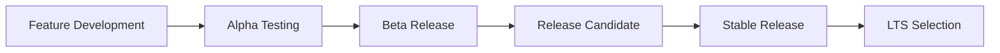

# Приложение G: Roadmap

## G.1 Видение и Стратегия

### Миссия
Сделать программирование интуитивным процессом описания преобразований информации, где система автоматически находит оптимальный способ выполнения.

### Долгосрочное Видение (5+ лет)
- **Универсальная платформа** для композиционных систем
- **Адаптивная оптимизация** в runtime
- **Гибридные архитектуры** (CPU/GPU/TPU)
- **Визуальное программирование** с формальной верификацией
- **Автоматическое управление** и достижение целей

### Ключевые Принципы Развития
1. **Обратная совместимость** - код v10 работает в v20
2. **Постепенная эволюция** - без breaking changes
3. **Community-driven** - развитие по запросам сообщества
4. **Research-backed** - научная основа для инноваций
5. **Production-first** - стабильность превыше всего

---

## G.2 Релизы 2025

### Q1 2025: v10.0.0 - Genesis
**Статус:** 🚀 В разработке (85% завершено)

#### Core
- [x] Минимальное ядро Flow (100% ✅)
- [x] Иммутабельный контекст (100% ✅)
- [x] Базовая композиция (100% ✅)
- [x] Система эффектов (100% ✅)
- [x] Модульная архитектура (100% ✅)

#### Modules
- [x] @holon/flow (100% ✅ - покрытие 99.48%)
- [x] @holon/effects (100% ✅ - покрытие 96.34%)
- [x] @holon/context (100% ✅ - покрытие 85%)
- [x] @holon/test-utils (100% ✅ - покрытие 100%)

#### Tooling
- [ ] CLI инструмент (0%)
- [ ] VS Code расширение (0%)
- [ ] TypeScript plugin (0%)
- [ ] Webpack loader (0%)

#### Documentation
- [x] Спецификация (100% ✅)
- [ ] Getting Started (0%)
- [ ] Туториалы (0%)
- [x] API Reference (100% ✅ - appendix-b-api.md)
- [ ] Примеры (20% - есть в тестах)

### Q2 2025: v10.1.0 - Foundation
**Статус:** 📋 Планируется

#### Стабилизация
- [ ] Исправление критических багов
- [ ] Оптимизация производительности
- [ ] Улучшение типизации
- [ ] Расширение тестового покрытия (>95%)

#### Новые модули
- [ ] @holon/flow-database
- [ ] @holon/flow-http
- [ ] @holon/flow-cache
- [ ] @holon/flow-queue

#### Интеграции
- [ ] Express adapter
- [ ] Fastify adapter
- [ ] Next.js plugin
- [ ] Prisma integration

### Q3 2025: v10.2.0 - Acceleration
**Статус:** 🎯 Цель

#### Performance
- [ ] JIT компилятор для горячих путей
- [ ] Автоматическая параллелизация
- [ ] Smart batching
- [ ] Memory pooling

#### Developer Experience
- [ ] Hot Module Replacement
- [ ] Time-travel debugging
- [ ] Visual Flow builder
- [ ] Performance profiler

#### Cloud Native
- [ ] @holon/flow-kubernetes
- [ ] @holon/flow-docker
- [ ] @holon/flow-serverless
- [ ] Multi-cloud abstractions

### Q4 2025: v10.3.0 - Intelligence
**Статус:** 🔮 Концепт

#### AI Integration
- [ ] @holon/flow-ai модуль
- [ ] Автоматическая оптимизация через ML
- [ ] Code generation из описаний
- [ ] Intelligent error handling

#### Advanced Features
- [ ] Distributed transactions
- [ ] Event sourcing support
- [ ] CQRS patterns
- [ ] Saga orchestration

---

## G.3 Roadmap 2026

### Q1 2026: v11.0.0 - Adaptive Control

#### Телеологическое Управление
- [ ] Полная система целей и objectives
- [ ] PID и MPC контроллеры
- [ ] Автоматическая оптимизация под цели
- [ ] Многокритериальная балансировка

#### WebAssembly
- [ ] WASM compilation target
- [ ] Browser-native execution
- [ ] Near-native performance
- [ ] Cross-platform binary

### Q2 2026: v11.1.0 - Distributed Mind

#### Distributed Systems
- [ ] Automatic sharding
- [ ] Consensus protocols
- [ ] Distributed state management
- [ ] Edge computing support

#### Federation
- [ ] Cross-cluster communication
- [ ] Multi-region deployment
- [ ] Global state synchronization
- [ ] Federated learning

### Q3 2026: v11.2.0 - Neural Evolution

#### Neuromorphic Computing
- [ ] Spiking neural network support
- [ ] Event-driven architecture
- [ ] Ultra-low power mode
- [ ] Brain-inspired computing

#### Self-Optimization
- [ ] Genetic algorithms for Flow evolution
- [ ] Automatic A/B testing
- [ ] Performance regression detection
- [ ] Self-healing systems

### Q4 2026: v11.3.0 - Semantic Intelligence

#### Семантическая Система
- [ ] Natural language описания Flow
- [ ] Автоматическая генерация кода из спецификаций
- [ ] Семантический поиск и рекомендации
- [ ] Самодокументируемый код

---

## G.4 Long-term Vision (2027-2030)

### 2027: Формальная Верификация

#### Математические Гарантии
- Автоматическое доказательство корректности
- Формальная спецификация на TLA+ или Coq
- Верификация инвариантов в compile-time
- Сертификация для критических систем

#### Визуальная Платформа
- Полноценный visual builder для Flow
- Drag-and-drop конструктор систем
- Визуальная отладка и профилирование
- Автоматическая генерация документации

### 2028: Масштабируемость

#### Распределённые Системы
- Автоматическое шардирование
- Консенсус-протоколы (Raft, Paxos)
- Глобальная репликация состояния
- Edge computing оптимизация

#### Интеграция с ML/AI
- Flow как ML pipeline
- AutoML для оптимизации Flow
- Интеграция с TensorFlow/PyTorch
- Обучающиеся контроллеры

### 2029: Полная Автоматизация

#### Автономное Управление
- Самооптимизирующиеся системы
- Предиктивная адаптация к нагрузке
- Автоматическое масштабирование
- Self-healing при сбоях

#### Универсальная Совместимость
- Компиляция в любой целевой язык
- Интеграция с legacy системами
- Автоматическая миграция кода
- Кросс-платформенное выполнение

### 2030: Зрелая Экосистема

#### Индустриальный Стандарт
- ISO/IEC стандартизация
- Широкое enterprise применение
- Образовательные программы
- Большое сообщество разработчиков

#### Специализированные Решения
- Domain-specific Flow языки
- Отраслевые библиотеки
- Готовые архитектурные паттерны
- Marketplace компонентов

---

## G.5 Release Schedule

### Version Numbering

```
MAJOR.MINOR.PATCH-PRERELEASE+BUILD

10.1.2-beta.3+2025.03.15
│  │ │   │    │      └── Build metadata
│  │ │   │    └────────── Pre-release version
│  │ │   └──────────────── Pre-release type
│  │ └──────────────────── Bug fixes
│  └────────────────────── New features
└───────────────────────── Breaking changes
```

### Release Cycle

| Type | Frequency | Support | Description |
|------|-----------|---------|-------------|
| **Major** | Yearly | 5 years | Breaking changes, new paradigms |
| **Minor** | Quarterly | 2 years | New features, improvements |
| **Patch** | Monthly | 1 year | Bug fixes, performance |
| **Nightly** | Daily | None | Experimental features |
| **LTS** | 2 years | 10 years | Long-term support |

### Release Process



---

## G.6 Community Milestones

### Adoption Targets

| Year | Target | Metric | Strategy |
|------|--------|--------|----------|
| 2025 | 10K developers | GitHub stars | Launch & evangelism |
| 2026 | 100K developers | npm downloads/month | Enterprise adoption |
| 2027 | 1M developers | Production deployments | Global expansion |
| 2028 | 10M developers | Active contributors | Education programs |
| 2029 | 100M systems | Running instances | Ubiquitous computing |
| 2030 | 1B devices | Edge deployments | IoT revolution |

### Ecosystem Growth

```typescript
// 2025: Foundation
{
  coreModules: 10,
  communityModules: 50,
  contributors: 100,
  companies: 10
}

// 2026: Expansion
{
  coreModules: 25,
  communityModules: 500,
  contributors: 1000,
  companies: 100
}

// 2027: Maturity
{
  coreModules: 50,
  communityModules: 5000,
  contributors: 10000,
  companies: 1000
}
```

---

## G.7 Research Projects

### Active Research Areas

#### Адаптивная Оптимизация
- **Lead:** MIT CSAIL
- **Goal:** Автоматическая оптимизация Flow в runtime
- **Timeline:** 2025-2027
- **Budget:** $3M

#### Визуальное Программирование
- **Lead:** Stanford HCI Lab
- **Goal:** Интуитивный конструктор Flow систем
- **Timeline:** 2025-2028
- **Budget:** $5M

#### Formal Verification
- **Lead:** Carnegie Mellon
- **Goal:** Provably correct Flow
- **Timeline:** 2025-2026
- **Budget:** $3M

### Partnerships

| Organization | Focus Area | Status |
|--------------|------------|---------|
| Google | Cloud Platform & TPU | In discussion |
| Microsoft | Azure integration | Signed |
| IBM | Enterprise tools | Pilot |
| Amazon | Serverless | Planning |
| Meta | VR/AR computing | Research |
| OpenAI | AI integration | Active |
| SpaceX | Space systems | Proposed |

---

## G.8 Migration Timeline

### Deprecation Schedule

| Feature | Deprecated | Removed | Alternative |
|---------|------------|---------|-------------|
| Legacy callbacks | v10.0 | v12.0 | Async/await Flow |
| Mutable context | v10.0 | v11.0 | Immutable context |
| Global state | v11.0 | v13.0 | Context injection |
| Sync-only Flow | v11.0 | v12.0 | Universal Flow |

### Migration Support

```typescript
// Automatic migration tool
npx holon-migrate@latest

// Analysis
→ Analyzing codebase...
→ Found 1,234 files
→ 456 files need migration
→ 15 breaking changes detected

// Interactive migration
? Start migration? (Y/n)
? Create backup? (Y/n)
? Run tests after migration? (Y/n)

// Execution
→ Migrating src/api/users.ts...
→ Migrating src/services/auth.ts...
→ Running tests...
✓ Migration complete!
```

---

## G.9 Metrics and KPIs

### Success Metrics

#### Technical
- **Performance:** 10x faster than v9
- **Bundle size:** <10KB core
- **Memory usage:** 50% reduction
- **Type coverage:** 100%
- **Test coverage:** >95%

#### Community
- **Contributors:** 1,000+ active
- **Issues resolved:** <48h average
- **Documentation:** 100% coverage
- **Translations:** 20+ languages
- **Satisfaction:** >4.8/5 rating

#### Business
- **Enterprise customers:** 100+
- **Revenue:** $10M ARR by 2027
- **Market share:** 5% of Node.js apps
- **Training certified:** 10,000 developers
- **Conference talks:** 50+ per year

### Tracking Dashboard

```typescript
// Real-time metrics dashboard
{
  url: "https://metrics.holon.sh",

  sections: {
    adoption: {
      downloads: "realtime",
      stars: "realtime",
      forks: "realtime"
    },

    performance: {
      benchmarks: "daily",
      regression: "per-commit",
      production: "p50, p95, p99"
    },

    community: {
      prs: "weekly",
      issues: "daily",
      discussions: "realtime"
    }
  }
}
```

---

## G.10 How to Contribute

### Development Process

1. **Proposal** - RFC in GitHub Discussions
2. **Design** - Technical specification
3. **Prototype** - Proof of concept
4. **Implementation** - Feature development
5. **Testing** - Comprehensive test suite
6. **Documentation** - User guides
7. **Release** - Staged rollout

### Contribution Areas

#### Code
- Core development
- Module creation
- Bug fixes
- Performance optimization
- Test writing

#### Non-Code
- Documentation
- Translations
- Design
- Community support
- Blog posts

### Getting Started

```bash
# Clone repository
git clone https://github.com/holon/flow.git

# Install dependencies
npm install

# Run tests
npm test

# Start development
npm run dev

# Submit PR
gh pr create
```

### Contact

- **GitHub:** github.com/holon/flow
- **Discord:** discord.gg/holon
- **Twitter:** @holonflow
- **Email:** team@holon.sh
- **Blog:** blog.holon.sh

---

## G.11 Investment and Funding

### Funding Rounds

| Round | Target | Use | Timeline |
|-------|--------|-----|----------|
| Seed | $2M | MVP development | Q1 2025 ✓ |
| Series A | $15M | Team & growth | Q3 2025 |
| Series B | $50M | Enterprise | Q2 2026 |
| Series C | $150M | Global expansion | Q1 2027 |

### Revenue Model

1. **Open Source Core** - Free forever
2. **Enterprise Support** - $50K-500K/year
3. **Cloud Platform** - Usage-based
4. **Training & Certification** - $500-5000/person
5. **Consulting** - $5K-50K/project

---

Это амбициозный план развития Holon Flow от революционной идеи до глобальной платформы, которая изменит само понимание программирования.